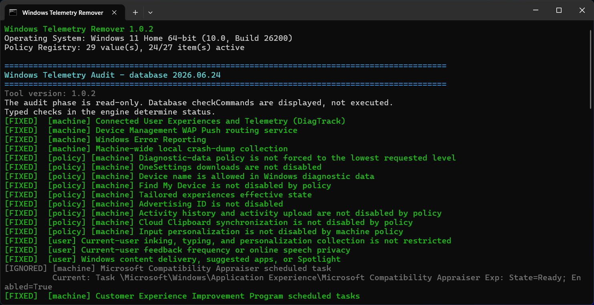

# Windows 11 Telemetry Remover



Windows Telemetry Remover is a local, PowerShell-based audit and hardening tool for Windows 11 privacy-related telemetry, diagnostics, feedback, cloud search, sync, Office connected experiences, crash reporting, and similar data-exposure surfaces.

The tool starts with a read-only audit, shows the current state, explains the downside of every fix, and prints the exact command that would be used before anything is changed.

## Supported Platform

Windows Telemetry Remover is intended for Windows 11.

The database may mention older Windows builds when a Microsoft policy was deprecated or when Microsoft documentation describes version-specific applicability, but the tool is not positioned as a general-purpose Windows 10 hardening tool.

## What It Does

- Audits privacy-related Windows, Microsoft Defender, OneDrive, Edge sync, Windows Search, Office, WER, and scheduled-task settings.
- Shows status labels for every database item:
  - `[FIXED]` - the item already matches the database target state.
  - `[ISSUE]` - the item is applicable and still needs a fix.
  - `[IGNORED]` - the item is still detected but intentionally hidden by the user from the action list.
  - `[UNKNOWN]` - the tool could not reliably determine the current state.
  - `[MANUAL]` - the item needs manual intervention before the fix can be trusted.
  - `[MAYBE]` - the fix may help in practice, but the official applicability does not fully cover this Windows edition.
  - `[SKIP]` - the item is not applicable to the current Windows edition or build.
  - `[DEPRECATED]` - the item is retained for version-aware databases but is obsolete on the current Windows build.
- Colors `[ISSUE]` by severity: urgent, high, medium, low, or very low.
- Displays `Exfiltration`, `Severity`, `Downside`, `Fix`, `Enable`, and proof URL/quote fields for detected issues.
- Applies changes only through typed, allow-listed actions from `spyware-db.json`.
- Creates backups and a change-history log before applying fixes.
- Supports ignored issues, so intentionally accepted findings stay visible as `[IGNORED]` without appearing in the action list.

## Files

- `Windows Telemetry Remover.bat` - double-click launcher.
- `windows-privacy-tool.ps1` - audit engine, menu, UAC handling, backups, logging, and fix application.
- `spyware-db.json` - declarative database of checks, fixes, enable commands, risk metadata, and proof fields.
- `spyware-db.schema.json` - JSON Schema for editors and agents.
- `.gitignore` - excludes local runtime state such as ignored issues and backup/log output.

No installation is required. The launcher uses the built-in Windows PowerShell runtime included with Windows 11.

## Quick Start

Download or clone the repository, then run:

```text
Windows Telemetry Remover.bat
```

The tool first performs a read-only audit. After that it shows an interactive menu:

```text
[1] Manually select detected issue numbers to fix
[2] Fix all detected issues
[3] Show details and check commands for one detected issue
[4] Run the audit again
[5] Manually select detected issue to ignore
[6] Show ignored issues
[7] Restore ignored issue
[0] Exit
```

Manual selections support comma-separated numbers and ranges:

```text
1,3,5-7
```

Machine-scope changes request elevation when needed. User-scope changes are applied for the current Windows account.

## Safety Model

`checkCommands` in the database are documentation only. The engine displays them but does not execute them.

The engine executes only supported declarative action types, such as service changes, registry DWORD changes, scheduled-task toggles, WER disabling, and explicit registry key/value removal. This keeps the JSON database from becoming arbitrary PowerShell execution.

Every database item must include:

- stable `id`
- `scope`
- `category`
- `description`
- `exfiltration`
- `severity` and `severityReason`
- `downsides`
- `threatProofUrl` and `threatProofExactQuote`
- `fixProofUrl` and `fixProofExactQuote`
- `checks`
- `disableActions`
- `enableActions`
- applicability metadata for Windows editions

Proof quality matters: threat quotes must prove collection, upload, cloud processing, sync, account linkage, sensitive local staging, or another concrete data-exposure mechanism. Fix quotes must prove the exact target state used by the fix.

## Backups And Logs

Before applying changes, the tool creates a timestamped backup folder under:

```text
C:\Users\Public\Documents\WindowsTelemetryRemoverBackups\<timestamp>
```

Backups are intended for manual rollback and auditing. The tool does not currently provide a one-click restore action.

Backups can include selected issue IDs, prior registry state, service state, scheduled-task XML, operation logs, and `change-history.jsonl`.

Useful backup files:

- `before-state.json` - audit status before applying selected fixes.
- `change-history.jsonl` - executed operations, result status, and matching `enableCommands`.
- `operations.log` - backup and fix operation log.
- `registry-001.reg`, `registry-002.reg`, ... - exported registry keys before modification.
- `services-before.csv` - service startup/state snapshot before modification.
- `scheduled-tasks\task-001.xml` - scheduled task XML exported before modification.

To manually restore an exported registry key, run an elevated PowerShell or Command Prompt and import the matching `.reg` file:

```powershell
reg import "C:\Users\Public\Documents\WindowsTelemetryRemoverBackups\<timestamp>\registry-001.reg"
```

To reverse a specific fix, inspect `change-history.jsonl` and run the relevant `enableCommands` entry. For example:

```powershell
Enable-ScheduledTask -TaskPath '\Microsoft\Windows\Customer Experience Improvement Program\' -TaskName 'Consolidator'
```

For service rollback, use `services-before.csv` to restore the previous startup mode and running/stopped state.

Local ignored issues are stored in:

```text
ignored-issues.json
```

That file is machine/user-specific and should not be committed.

## Validate The Database

```powershell
powershell.exe `
    -NoProfile `
    -ExecutionPolicy Bypass `
    -File .\windows-privacy-tool.ps1 `
    -DatabasePath .\spyware-db.json `
    -ValidateOnly
```

## Run Audit Only

```powershell
powershell.exe `
    -NoProfile `
    -ExecutionPolicy Bypass `
    -File .\windows-privacy-tool.ps1 `
    -DatabasePath .\spyware-db.json `
    -AuditOnly
```

## Non-Interactive Use

Apply specific database IDs:

```powershell
powershell.exe `
    -NoProfile `
    -ExecutionPolicy Bypass `
    -File .\windows-privacy-tool.ps1 `
    -DatabasePath .\spyware-db.json `
    -ApplyIds "service.diagtrack,policy.onesettings-downloads" `
    -NonInteractive
```

## Important Notes

- This is a privacy and hardening tool, not an antivirus and not a malware remover.
- Some fixes reduce Windows, Office, Defender, OneDrive, Search, troubleshooting, upgrade-readiness, or enterprise-management functionality.
- Read every `Downside` before using "fix all".
- Windows 11 Home can expose or honor some policy-backed settings differently from Pro, Enterprise, Education, or IoT Enterprise. The audit prints `isApplicable`, `[MAYBE]`, `[MANUAL]`, `[SKIP]`, or `[DEPRECATED]` when that distinction matters.
- Microsoft Defender cloud-protection settings are a security/privacy tradeoff. Disabling them can reduce protection against new threats.

## License

Windows Telemetry Remover is licensed under the Apache License, Version 2.0,
with the Commons Clause License Condition v1.0.

You may use, modify, and redistribute this project, including inside larger
commercial projects, but you may not sell Windows Telemetry Remover itself or
offer a product/service whose value derives entirely or substantially from this
software. Attribution notices from `NOTICE` and the license terms must be
preserved.
